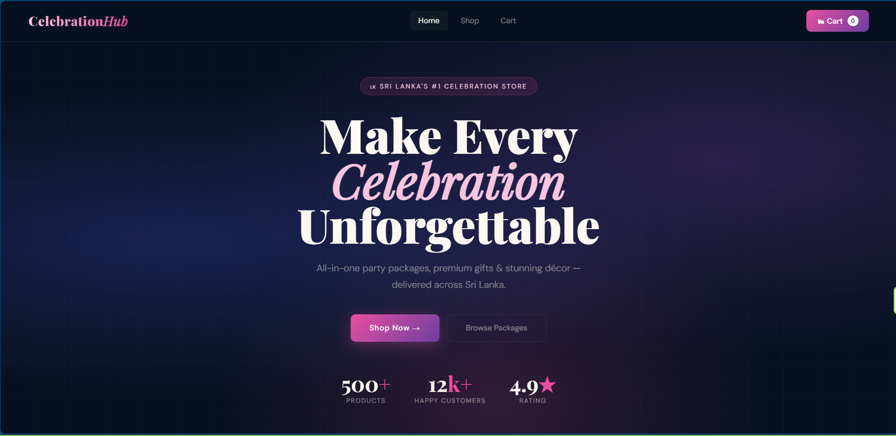
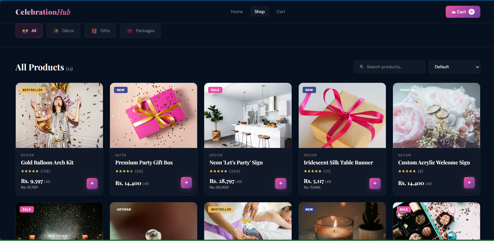
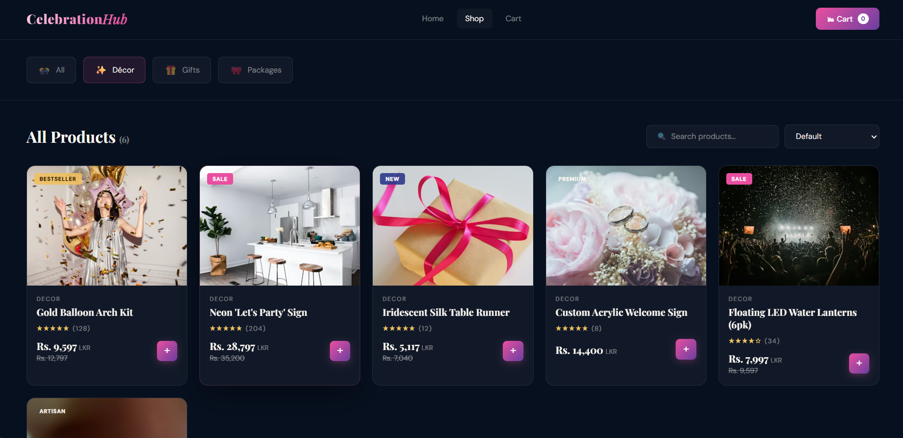
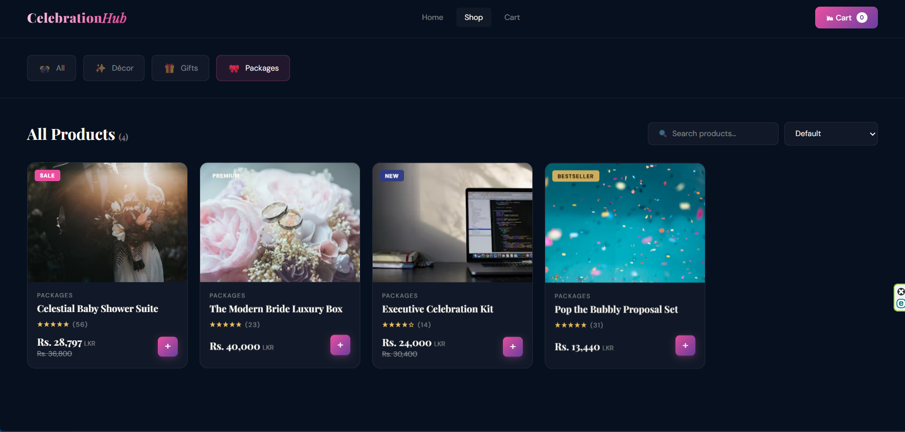
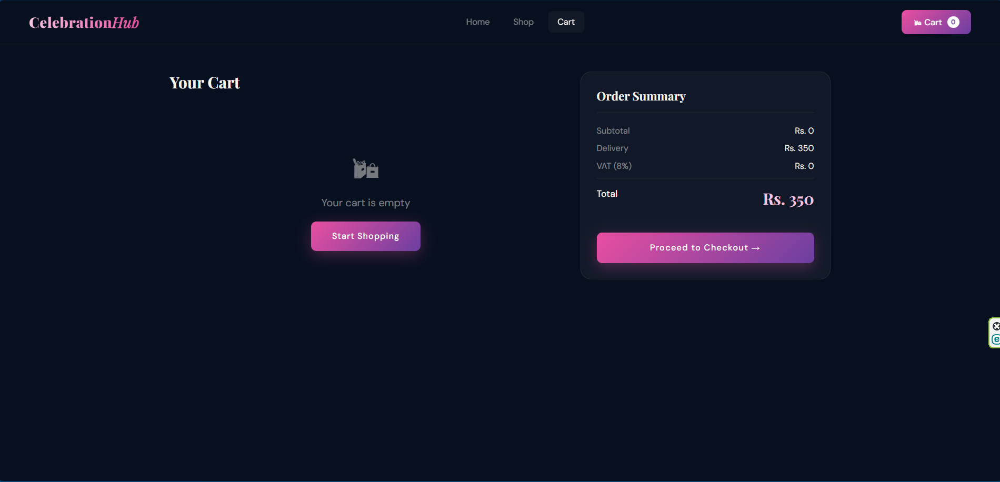
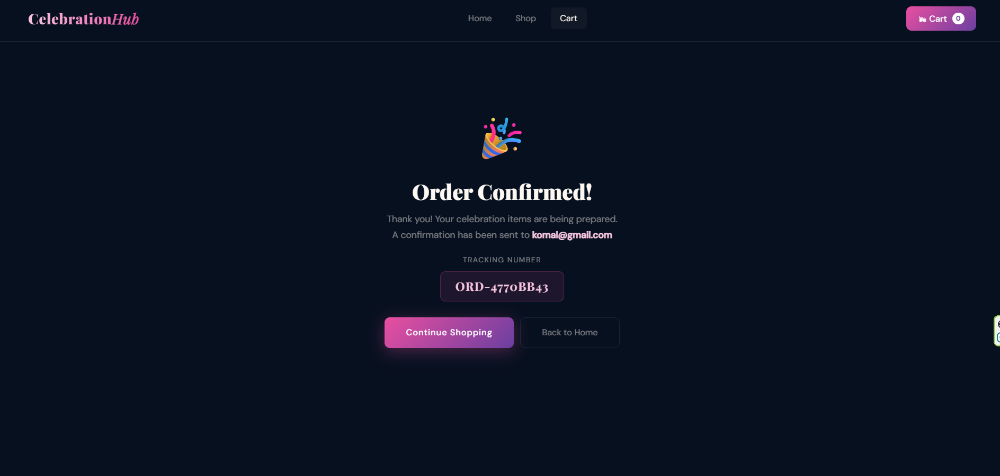
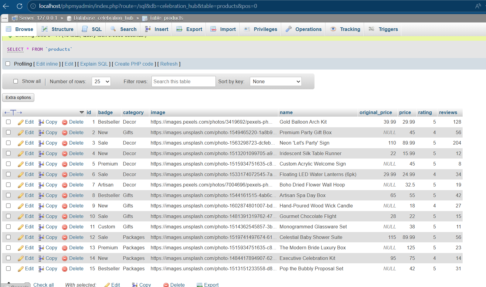
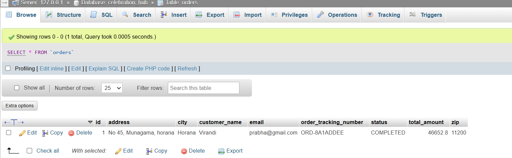
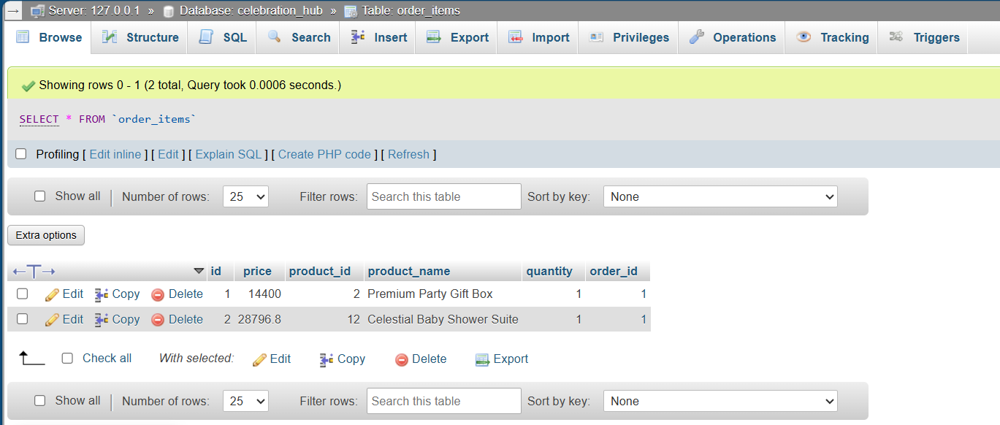

  🎉 CelebrationHub – Full Stack E-Commerce Celebration Store

> A modern **Full-Stack E-Commerce Web Application** for purchasing celebration décor, gifts, and event packages across Sri Lanka.

CelebrationHub allows users to browse products, filter by category, add items to a cart, and place orders.
The system uses a **Spring Boot REST API backend**, **MySQL database**, and an **interactive HTML/CSS/JavaScript frontend**.

---

 🌟 Project Overview

CelebrationHub is an **online celebration store** designed to provide a seamless shopping experience for party decorations, premium gifts, and celebration packages.

The system demonstrates a **complete full-stack architecture**, integrating:

| Layer      | Technology              |
| ---------- | ----------------------- |
| Frontend   | HTML5, CSS3, JavaScript |
| Backend    | Spring Boot (Java)      |
| Database   | MySQL                   |
| API        | RESTful API             |
| ORM        | Spring Data JPA         |
| Build Tool | Maven                   |

---

 🏗 System Architecture

```
User Browser
     │
     ▼
Frontend (HTML / CSS / JavaScript)
     │
     ▼
REST API (Spring Boot Controllers)
     │
     ▼
Service Layer (Business Logic)
     │
     ▼
Repository Layer (Spring Data JPA)
     │
     ▼
MySQL Database
```

---

# 🎯 Key Features

### 🛍 Product Catalog

* Browse celebration products
* Product cards with images and pricing
* Product ratings and reviews

### 🔍 Category Filtering

* Décor
* Gifts
* Packages
* All Products

### 🔎 Search Function

Users can search products instantly.

### 🛒 Shopping Cart

* Add products
* Increase / decrease quantity
* Remove products

### 💳 Checkout System

* Customer information form
* Delivery cost calculation
* VAT calculation
* Order confirmation

### 📦 Order Management

* Orders stored in database
* Order tracking number generated
* Order items stored separately

---

# 🖥 Frontend Overview

The frontend is designed with **modern UI components and responsive layout**.

### Main UI Components

| Component          | Description             |
| ------------------ | ----------------------- |
| Hero Section       | Marketing message       |
| Product Grid       | Dynamic product display |
| Category Filters   | Product filtering       |
| Shopping Cart      | Cart management         |
| Checkout Form      | Customer order input    |
| Order Confirmation | Tracking number display |

---

# 🏠 Home Page



The homepage introduces the platform and encourages users to browse celebration products.

---

# 🛍 Shop Page



Displays all available products with:

* product image
* rating
* price
* add-to-cart button

---

# 🎁 Category Filtering

### Decor Category



Users can filter products based on celebration categories.

---

### Packages Category



Event packages and premium celebration bundles are displayed here.

---

# 🛒 Shopping Cart

### Empty Cart



### Cart With Products

The cart dynamically calculates:

* Subtotal
* Delivery
* VAT
* Total

---

# ✅ Order Confirmation



After placing an order, the system generates:

* Order Tracking Number
* Confirmation message

---

# ⚙ Backend Architecture

The backend follows **Spring Boot layered architecture**.

```
Controller
   │
Service
   │
Repository
   │
Database
```

### Controller Layer

Handles HTTP requests.

Example:

```
ProductController
OrderController
```

Example endpoint:

```
GET /api/products
```

---

### Service Layer

Contains business logic.

Examples:

```
ProductService
OrderService
```

Responsibilities:

* Product retrieval
* Order processing
* Business rules

---

### Repository Layer

Handles database communication using **Spring Data JPA**.

Examples:

```
ProductRepository
OrderRepository
```

---

# 🗄 Database Design

The system uses **MySQL relational database**.

### Products Table



Stores:

* product name
* category
* price
* rating
* reviews
* image URL

---

### Orders Table



Stores:

* customer name
* email
* address
* order status
* order tracking number
* total amount

---

### Order Items Table



Stores:

* product id
* product name
* quantity
* price
* order id

---

# 🔗 API Endpoints

### Product APIs

| Method | Endpoint                            | Description              |
| ------ | ----------------------------------- | ------------------------ |
| GET    | `/api/products`                     | Get all products         |
| GET    | `/api/products/{id}`                | Get product by ID        |
| GET    | `/api/products/category/{category}` | Get products by category |
| POST   | `/api/products`                     | Add product              |
| PUT    | `/api/products/{id}`                | Update product           |
| DELETE | `/api/products/{id}`                | Delete product           |

---

### Order APIs

| Method | Endpoint      | Description |
| ------ | ------------- | ----------- |
| POST   | `/api/orders` | Place order |
| GET    | `/api/orders` | View orders |

---

# 🛠 Database Configuration

`application.properties`

```
spring.datasource.url=jdbc:mysql://localhost:3306/celebration_hub
spring.datasource.username=root
spring.datasource.password=
spring.jpa.hibernate.ddl-auto=update
```

---

# ▶ How To Run The Project

### 1️⃣ Start MySQL

Using **XAMPP**

Start:

```
MySQL
```

---

### 2️⃣ Run Backend

Navigate to backend folder.

```
cd online_celebration_store
```

Run:

```
mvn spring-boot:run
```

Backend runs on:

```
http://localhost:8080
```

Test API:

```
http://localhost:8080/api/products
```

---

### 3️⃣ Run Frontend

Open the frontend file:

```
Online_celebration_frontend.html
```

OR run using **VS Code Live Server**.

---

# 📊 Project Workflow

```
User selects product
        │
Add to cart
        │
Checkout
        │
Order API called
        │
Spring Boot processes order
        │
Order saved in MySQL
        │
Tracking number generated
```

---

# 🔮 Future Improvements

* User authentication
* Admin dashboard
* Payment gateway integration
* Product image uploads
* Order tracking system

---

# 👩‍💻 Author

**Virandi Pulasinghe**

Computer Science Student
Full-Stack Web Application Project

---
 
 
 
